# EdgePrompt: System Design & Architecture

## Introduction

EdgePrompt is a framework for implementing pragmatic guardrails for Large Language Models (LLMs) in K-12 educational settings through structured prompting. Inspired by the paper "EdgePrompt: Engineering Guardrail Techniques for Offline LLMs in K-12 Educational Settings," this project aims to address educational disparities in remote regions with limited connectivity by enabling offline-capable content safety controls.

### Current Implementation Status

> **Note:** The current implementation is a work-in-progress and does not yet implement all the features described in the EdgePrompt paper. This document describes both the current state and the intended design.

The current implementation focuses primarily on:
- Basic material processing (PDF, DOCX, TXT extraction)
- Question template generation
- Simple question generation workflow

Areas still under development include:
- Multi-stage validation
- Robust guard rails
- Complete student response evaluation
- Authentication and user management

## Edge Computing & Offline-First Rationale

### Educational Context and Connectivity Challenges

In many educational settings, particularly in Indonesia's 3T regions (Frontier, Outermost, Underdeveloped), internet connectivity is unreliable, expensive, or completely unavailable. Yet educational activities cannot be dependent on connectivity:

- **Classroom Reliability**: Teaching and learning activities must proceed on schedule regardless of internet status
- **Equitable Access**: Educational opportunities should not be limited to students with reliable internet
- **Privacy and Security**: Student data should be processable locally without requiring constant external transmission
- **Resource Constraints**: Limited bandwidth must be used judiciously in school settings

EdgePrompt addresses these challenges by implementing an offline-first approach where core educational functions operate locally without requiring internet connectivity.

### Offline-First vs. Offline-Only

EdgePrompt is designed with an offline-first philosophy, not offline-only:

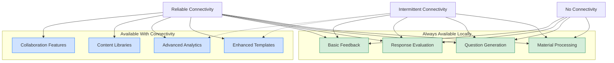

This approach ensures:

1. **Core Functions Always Work**: Essential educational activities continue regardless of connectivity
2. **Progressive Enhancement**: Additional capabilities become available when connectivity exists
3. **Resilience**: The system degrades gracefully when connectivity is lost
4. **Resource Optimization**: Bandwidth is used for enhancement rather than basic functionality

### Progressive Enhancement Opportunities

When connectivity is available, EdgePrompt can enhance its capabilities:

1. **Content Generation**:
   - Use cloud-based larger LLMs to generate and refine prompts
   - Access expanded educational content libraries
   - Generate more sophisticated question templates

2. **Evaluation Enhancement**:
   - Leverage more powerful models for nuanced response evaluation
   - Incorporate external reference materials into assessment
   - Apply more sophisticated validation rules

3. **Collaborative Features**:
   - Synchronize data across multiple devices
   - Enable teacher collaboration on materials
   - Share prompt templates and educational resources
   - Aggregate anonymized analytics for educational research

4. **System Maintenance**:
   - Update application components
   - Refresh LLM models
   - Synchronize security patches
   - Backup student data

### Educational Technology Requirements

The educational context imposes specific requirements that make edge computing particularly valuable:

1. **Classroom Timing**: Lessons must proceed on schedule regardless of external factors
2. **Predictable Performance**: Response times must remain consistent
3. **Immediate Feedback**: Students need prompt assessment feedback
4. **Customized Content**: Materials must be adaptable to local educational needs
5. **Teacher Control**: Educators need immediate access to adjust materials

### Technical Approach

EdgePrompt implements this offline-first approach through:

1. **Local LLM Processing**: Using smaller, optimized models (e.g., Llama 3.2 3B) suitable for edge devices
2. **Structured Prompting**: Carefully designed prompts that maximize performance of smaller models
3. **Efficient Storage**: Local database with smart synchronization capabilities
4. **Multi-Stage Processing**: Breaking complex tasks into manageable steps for edge devices
5. **Connectivity Detection**: Dynamically adjusting capabilities based on available connectivity

## Problem Statement

In Indonesia's remote 3T regions (Frontier, Outermost, Underdeveloped), unreliable internet connectivity makes cloud-based solutions impractical for classroom activities. Teaching materials need to be processed and student responses evaluated locally without constant internet access, while still maintaining appropriate content safety guardrails.

## Goals

The framework aims to achieve three key objectives:
1. Enable structured and safe content generation in offline settings
2. Provide accurate assessment with edge-based validation
3. Maintain consistency in distributed evaluation processes

## Design Principles

EdgePrompt is built on these core principles:

1. **Backend-First Security**: All sensitive operations (LLM interactions, validation) happen on the backend
2. **Structured Prompting**: Templates embed safety constraints with formal validation rules
3. **Multi-Stage Validation**: Sequential prompt-based checks with explicit boundary conditions
4. **Edge Compatibility**: Optimized for operation in low-resource environments
5. **Separation of Concerns**: Clear boundaries between content processing, generation, and validation

## System Architecture

### High-Level Architecture

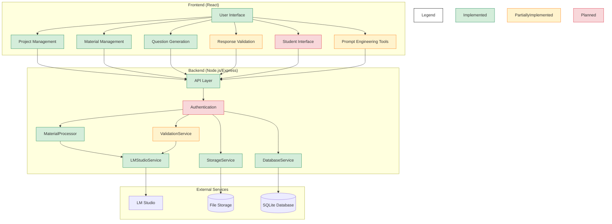

_Legend: Green = Implemented, Yellow = Partially Implemented, Red = Planned_

### Implementation Status

| Component | Status | File Location | Notes |
|-----------|--------|---------------|-------|
| **Backend** |
| DatabaseService | Implemented | `backend/src/services/DatabaseService.ts` | Core database operations |
| StorageService | Implemented | `backend/src/services/StorageService.ts` | File storage management |
| MaterialProcessor | Implemented | `backend/src/services/MaterialProcessor.ts` | Material extraction and processing |
| LMStudioService | Implemented | `backend/src/services/LMStudioService.ts` | LLM integration |
| ValidationService | Partial | `backend/src/services/ValidationService.ts` | Basic validation; needs multi-stage implementation |
| Authentication | Planned | N/A | User authentication and authorization |
| **Frontend** |
| Project Management | Implemented | `frontend/src/components/project/` | Project CRUD operations |
| Material Management | Implemented | `frontend/src/components/teacher/` | Material upload and management |
| Question Generation | Implemented | `frontend/src/components/teacher/QuestionGenerator.tsx` | Basic question generation |
| Response Validation | Partial | `frontend/src/components/student/ResponseValidator.tsx` | Basic validation; UI needs improvement |
| Student Interface | Planned | N/A | Complete student-facing interface |
| Prompt Engineering Tools | Partial | `frontend/src/components/tools/PromptEngineeringTool.tsx` | Basic implementation; needs integration with backend |

### Component Relationships

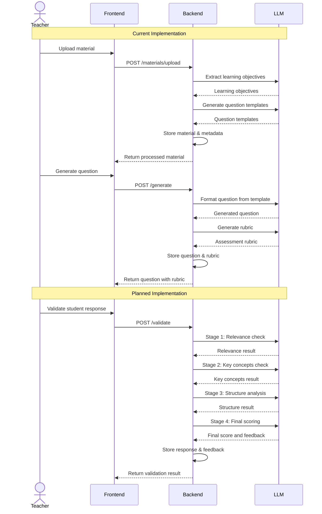

## Core Components

### Backend Services

The backend is organized into several key services, each with specific responsibilities:

#### DatabaseService

**Status**: Implemented  
**File**: `backend/src/services/DatabaseService.ts`

This service manages all database operations using SQLite:

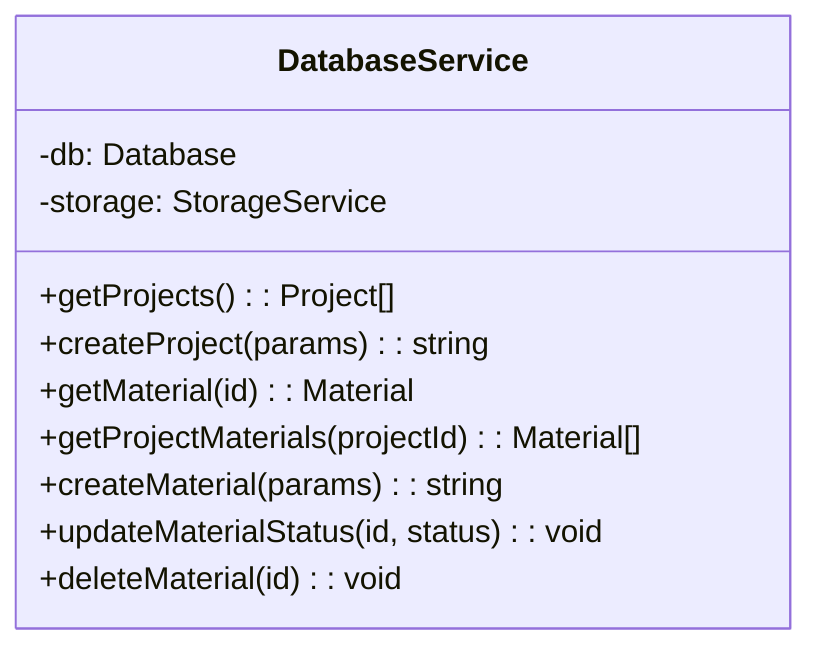

**Potential Improvements**:
- Add transaction management for complex operations
- Implement query optimization for large datasets
- Add proper error handling with custom error classes

#### StorageService

**Status**: Implemented  
**File**: `backend/src/services/StorageService.ts`

Manages file storage and processing:

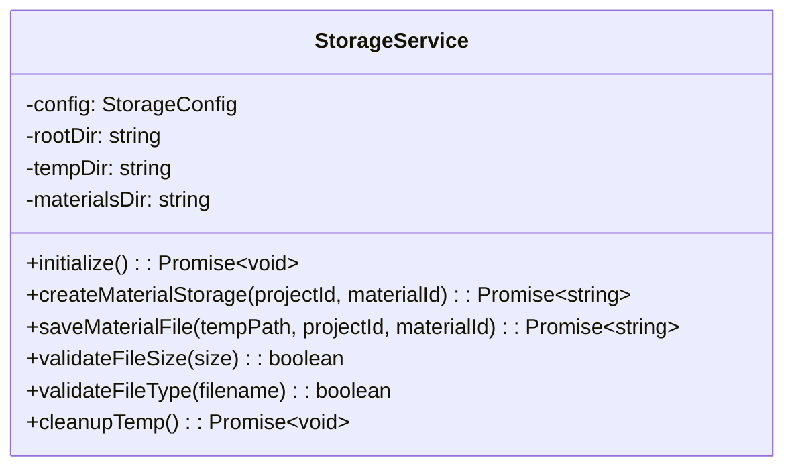

**Potential Improvements**:
- Add compression for storage efficiency
- Implement file deduplication
- Add more robust error handling for file operations

#### MaterialProcessor

**Status**: Implemented  
**File**: `backend/src/services/MaterialProcessor.ts`

Handles content extraction and processing:

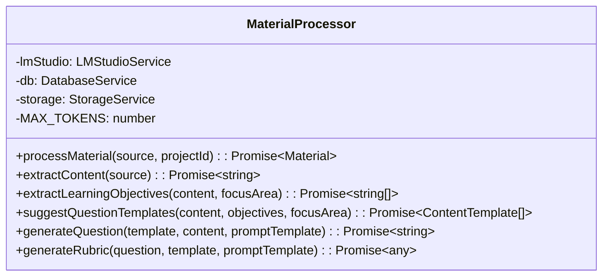

**Potential Improvements**:
- Optimize content processing for large documents
- Implement caching for expensive operations
- Add better error handling for LLM failures
- Enhance prompt engineering for more reliable outputs

#### ValidationService

**Status**: Partially Implemented  
**File**: `backend/src/services/ValidationService.ts`

Handles student response validation:

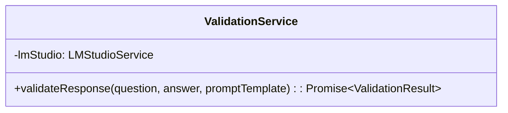

**Missing Features**:
- Multi-stage validation process
- Granular scoring mechanisms
- Robust prompt injection protection
- Context-aware validation strategies

This service requires significant development to implement the multi-stage validation described in the paper:
1. Stage 1: Initial relevance check
2. Stage 2: Key concepts evaluation
3. Stage 3: Structure and organization assessment
4. Stage 4: Final scoring and feedback generation

#### LMStudioService

**Status**: Implemented  
**File**: `backend/src/services/LMStudioService.ts`

Provides the interface to the LLM:

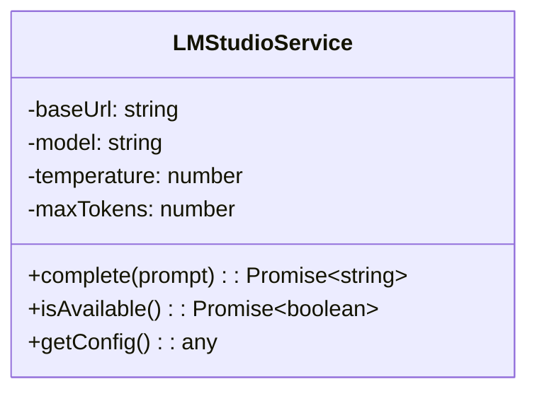

**Potential Improvements**:
- Add support for multiple models
- Implement model fallback strategies
- Add streaming response support
- Add better error handling for network issues

### Frontend Components

#### Project Management

**Status**: Implemented  
**Directory**: `frontend/src/components/project/`

Components for creating and managing projects:
- `ProjectForm.tsx`: Creates new projects
- `ProjectEditForm.tsx`: Edits existing projects
- `ProjectView.tsx`: Displays project details
- `ProjectPanel.tsx`: Lists all projects

#### Material Management

**Status**: Implemented  
**Directory**: `frontend/src/components/teacher/`

Components for uploading and managing teaching materials:
- `MaterialUploader.tsx`: File upload interface
- `MaterialDetailView.tsx`: Detailed view of material content
- `MaterialsManager.tsx`: Lists all materials
- `SimplifiedMaterialUploader.tsx`: Streamlined upload interface

#### Question Generation

**Status**: Implemented  
**File**: `frontend/src/components/teacher/QuestionGenerator.tsx`

Handles the generation of questions from templates:
- Template selection
- Question generation
- Rubric creation

#### Response Validation

**Status**: Partially Implemented  
**File**: `frontend/src/components/student/ResponseValidator.tsx`

Validates student responses:
- Basic validation
- Score calculation
- Feedback display

**Missing Features**:
- Multi-stage validation UI
- Detailed feedback visualization
- Teacher review interface

## Interface Options

### Frontend Interface Architecture

```mermaid
graph TB
    subgraph "Teacher Interface (Full)"
        TUI[Teacher UI]
        ProjectMgmt[Project Management]
        Materials[Materials Management]
        Templates[Prompt Templates]
        Questions[Question Generation]
        Analytics[Student Analytics]
        Tools[Prompt Engineering Tools]
    end
    
    subgraph "Student Interface (Planned)"
        SUI[Student UI]
        Assignments[View Assignments]
        SubmitResponses[Submit Responses]
        ViewFeedback[View Feedback]
        ProgressTrack[Progress Tracking]
    end
    
    subgraph "Limited Mobile Interface (Future)"
        MUI[Mobile UI]
        OfflineAccess[Offline Access]
        SimpleSubmission[Simple Submission]
        BasicFeedback[Basic Feedback]
    end
    
    subgraph "Backend API"
        API[API Layer]
    end
    
    TUI --> API
    SUI --> API
    MUI --> API
    
    classDef implemented fill:#d4edda,stroke:#198754;
    classDef partial fill:#fff3cd,stroke:#fd7e14;
    classDef planned fill:#f8d7da,stroke:#dc3545;
    classDef future fill:#e0cffc,stroke:#6f42c1;
    
    class TUI,ProjectMgmt,Materials,Questions implemented;
    class Templates,Tools partial;
    class Analytics planned;
    class SUI,Assignments,SubmitResponses,ViewFeedback,ProgressTrack planned;
    class MUI,OfflineAccess,SimpleSubmission,BasicFeedback future;
    class API implemented;
    
    %% Color legend
    style Implemented fill:#d4edda,stroke:#198754
    style PartiallyImplemented fill:#fff3cd,stroke:#fd7e14
    style Planned fill:#f8d7da,stroke:#dc3545
    style Future fill:#e0cffc,stroke:#6f42c1
```

> **Legend:** Green = Implemented, Yellow = Partially Implemented, Red = Planned, Purple = Future Development

### Student Interface Workflow

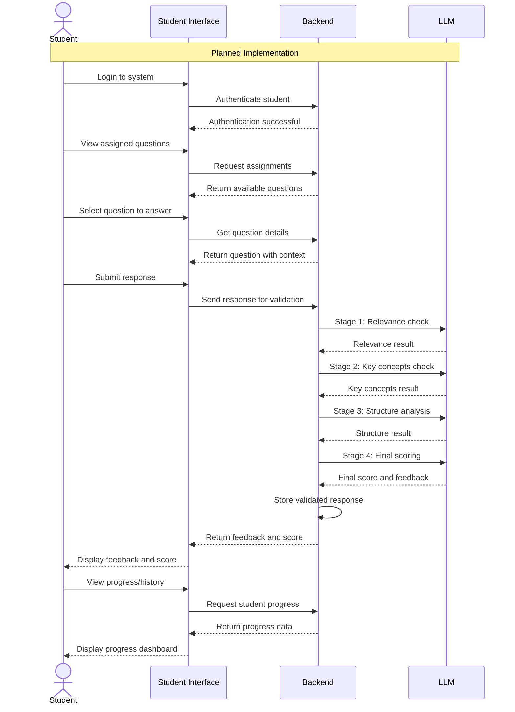

> **Note:** This workflow represents the planned student interface, which is not yet implemented.

## Key Workflows

### Current Implementation: Material Processing

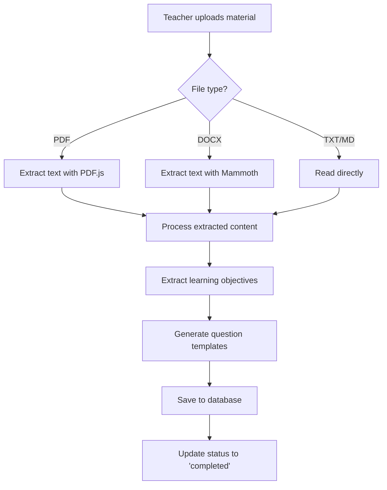

### Current Implementation: Question Generation

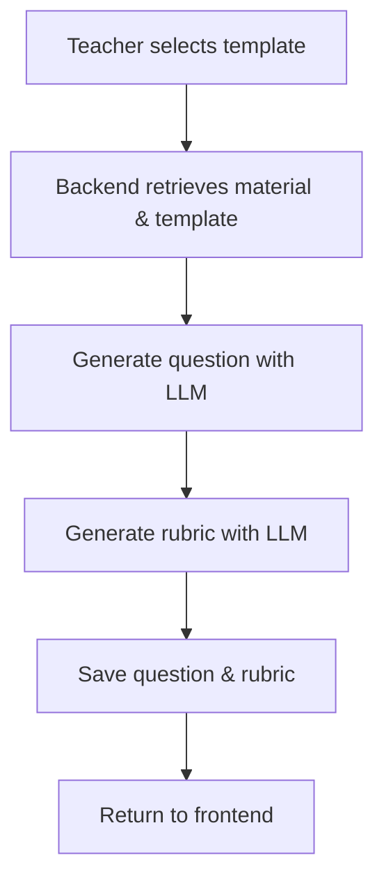

### Planned Implementation: Multi-Stage Validation

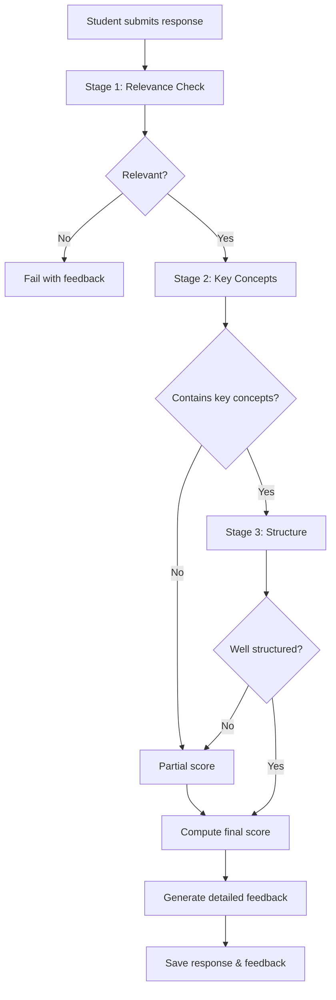

## Data Models

### Entity Relationship

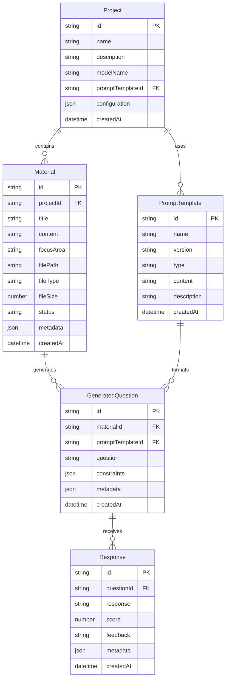

## Implementation Challenges & Gaps

### 1. Prompt Injection Protection

The current implementation lacks robust protection against prompt injection attacks. As demonstrated in the development discussions, both material content and student responses can potentially be manipulated to trick the LLM.

**Potential Solutions**:
- Implement content sanitization
- Use structured prompt templates with clear boundaries
- Add detection for suspicious inputs
- Use multi-stage validation to catch inconsistencies

### 2. Multi-Stage Validation

The paper describes a sophisticated multi-stage validation process, but the current implementation uses a simpler approach. The full implementation would require:

**Required Development**:
- Sequential prompt-based evaluations
- Context management between validation stages
- Score aggregation logic
- More detailed rubric structure

### 3. Performance Optimization

The current implementation may face performance challenges with larger materials or complex validation tasks.

**Areas for Improvement**:
- Content chunking strategies
- Caching frequently used data
- Optimizing prompt lengths
- Using quantized models for edge deployment

### 4. User Experience

The teacher and student interfaces need further refinement to provide a seamless experience.

**Areas for Improvement**:
- Streamlined material upload process
- Better visualization of generated questions
- More detailed feedback displays
- Progress indicators for long-running operations

### 5. Production-Ready Features

Several critical features needed for production deployment are missing:

**Missing Features**:
- **Authentication & Authorization**: User authentication, role-based access control (teacher vs. student)
- **Data Persistence**: Proper backup and recovery mechanisms
- **Error Handling**: Comprehensive error logging and recovery strategies
- **Deployment Pipeline**: CI/CD, containerization, configuration management
- **Monitoring**: System health checks, performance monitoring, usage analytics
- **Security**: HTTPS implementation, rate limiting, input validation

### 6. Student Interface

The student-facing interface is currently not implemented. This essential component would require:

**Required Development**:
- Student login and session management
- Assignment/question display interface
- Response submission system
- Feedback visualization
- Progress tracking and history

### 7. Prompt Engineering Tools Integration

While a basic version of the prompt engineering tools exists, it lacks proper integration with the backend:

**Areas for Improvement**:
- Connect to actual LLM for real-time testing
- Save/load prompt templates
- Analyze prompt effectiveness
- Support prompt version history
- Provide feedback on prompt quality

## File Organization

```
edge-prompt/
├── backend/                   # Server-side code
│   ├── scripts/               # Helper scripts
│   ├── src/                   # Source code
│   │   ├── db/                # Database layer
│   │   │   ├── migrations/    # Database migrations
│   │   │   ├── schema.sql     # Database schema
│   │   │   └── index.ts       # Database operations
│   │   ├── services/          # Core services
│   │   │   ├── DatabaseService.ts     # Database operations
│   │   │   ├── LMStudioService.ts     # LLM integration
│   │   │   ├── MaterialProcessor.ts   # Material processing
│   │   │   ├── StorageService.ts      # File storage
│   │   │   └── ValidationService.ts   # Response validation
│   │   ├── types/             # TypeScript definitions
│   │   └── index.ts           # Main entry point
├── common/                    # Shared code
│   └── src/
│       └── types/             # Shared type definitions
└── frontend/                  # Client-side code
    ├── public/                # Static assets
    ├── src/                   # Source code
        ├── components/        # React components
        │   ├── common/        # Common UI components
        │   ├── project/       # Project management
        │   ├── prompt/        # Prompt template management
        │   ├── student/       # Student interfaces
        │   └── teacher/       # Teacher interfaces
        ├── contexts/          # React contexts
        ├── services/          # API services
        └── types/             # TypeScript definitions
```

## Deployment Considerations

### Edge Deployment Requirements

The EdgePrompt framework is specifically designed for edge deployment in resource-constrained environments:

1. **Hardware Requirements**:
   - Minimum: RTX-class GPU (e.g., RTX 3060 with 12GB VRAM) or Jetson-class embedded computer
   - RAM: 16GB minimum, 32GB recommended
   - CPU: 6+ cores recommended
   - Storage: 20GB+ for materials, models, and database
   - CUDA drivers (for NVIDIA GPUs)

2. **Software Requirements**:
   - LM Studio with Llama 3.2 3B or similar model
   - Node.js runtime
   - SQLite database

3. **Network Considerations**:
   - Must function fully offline
   - Optional connectivity for updates
   - Local network for classroom deployment

### Performance Optimization

To ensure the system performs well on edge devices:

1. **Model Selection**:
   - Use smaller, quantized models (e.g., Llama 3.2 3B)
   - Optimize for inference speed over absolute quality
   - Consider model pruning techniques

2. **Content Processing**:
   - Implement chunking for large documents
   - Use efficient extraction methods
   - Optimize prompt length

3. **Resource Management**:
   - Implement cleanup routines for temporary files
   - Add memory usage monitoring
   - Implement graceful degradation for resource constraints

## Future Development Directions

Based on the EdgePrompt paper and current implementation status, future development should focus on:

### 1. Core Functionality Completion

- **Multi-Stage Validation**: Implement the full validation pipeline as described in the paper
- **Student Interface**: Develop a complete student-facing interface
- **Authentication System**: Add user management with role-based access control
- **Prompt Injection Protection**: Implement robust safeguards against manipulation

### 2. Enhanced User Experience

- **Teacher Dashboard**: Analytics on student performance and question effectiveness
- **Batch Processing**: Support for managing multiple classes and assignments
- **Offline Synchronization**: Smart sync when connectivity becomes available
- **Mobile Interface**: Responsive design for tablet/mobile use in classrooms

### 3. Educational Features

- **Learning Analytics**: Track student progress over time with detailed metrics
- **Personalized Learning**: Adaptive question generation based on student performance
- **Peer Review**: Enable student peer assessment with teacher oversight
- **Curriculum Alignment**: Tools to align questions with specific curriculum standards
- **Multi-language Support**: Expanded support beyond Indonesian/English
- **Gamification Elements**: Achievement badges, progress tracking, and engagement features

### 4. Technical Enhancements

- **Distributed Deployment**: Support for school-wide deployment with central management
- **Edge Optimization**: Further improvements for low-resource environments
- **API Ecosystem**: Public APIs for integration with existing school systems
- **Backup & Recovery**: Robust data protection systems
- **Content Library**: Shared repository of educational materials
- **Model Swapping**: Support for easily switching between different LLMs

### 5. Community Features

- **Teacher Collaboration**: Shared prompt templates and educational materials
- **Parent/Guardian Portal**: Access to student progress and performance
- **Community Question Bank**: Crowdsourced and verified question templates
- **Professional Development**: Tools to help teachers improve prompt engineering skills

## Contributing Guidelines

### Development Workflow

1. **Setup Environment**:
   ```bash
   # Clone the repository
   git clone https://github.com/build-club-ai-indonesia/edge-prompt
   cd edge-prompt

   # Install dependencies
   npm install
   npm run build:common

   # Start development servers
   ./run.sh
   ```

2. **Understanding the Codebase**:
   - Start with the core services in `backend/src/services/`
   - Examine the database schema in `backend/src/db/schema.sql`
   - Review the React components in `frontend/src/components/`

3. **Key Areas for Contribution**:
   - Multi-stage validation implementation
   - Prompt injection protection
   - Performance optimization
   - User interface improvements

## References

1. The EdgePrompt paper: "EdgePrompt: Engineering Guardrail Techniques for Offline LLMs in K-12 Educational Settings"
2. LM Studio documentation: [https://lmstudio.ai/](https://lmstudio.ai/)
