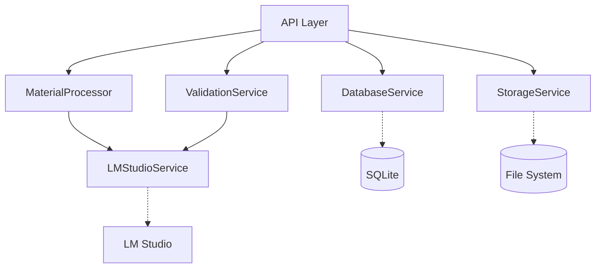
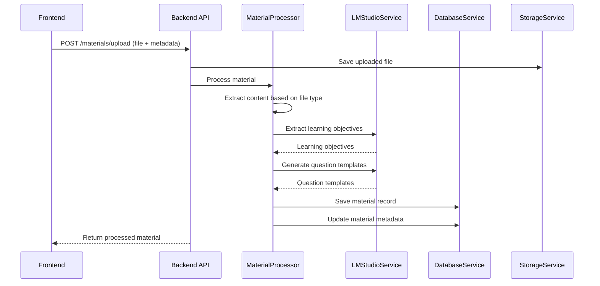
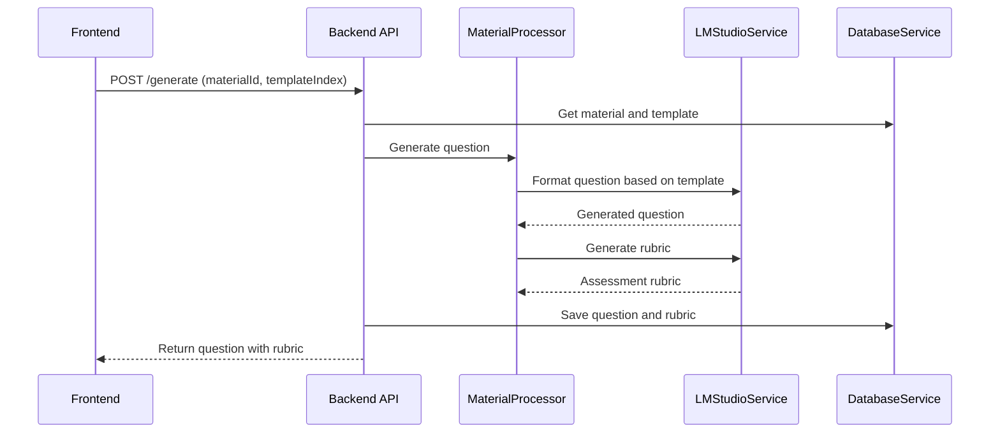
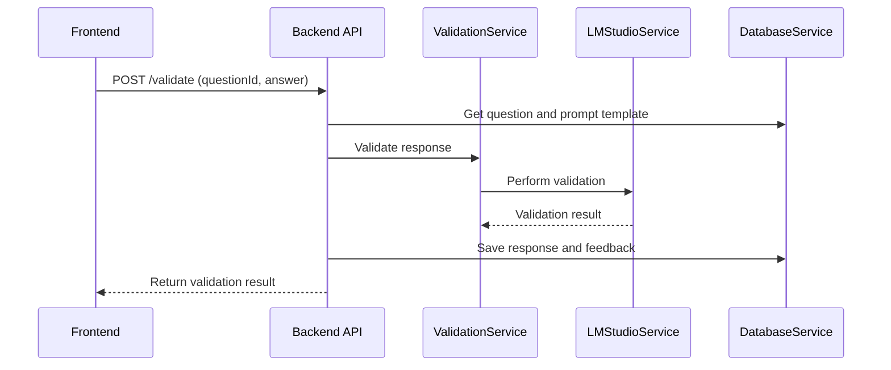

# EdgePrompt: Implementation Design & Developer Reference

## Purpose of This Document

This document serves as a practical implementation guide for EdgePrompt developers. While other documentation covers philosophical principles ([GUIDELINES.md](GUIDELINES.md)), architecture ([ARCHITECTURE.md](ARCHITECTURE.md)), and technical requirements ([TECHNICAL_REQUIREMENTS.md](TECHNICAL_REQUIREMENTS.md)), this document focuses on:

- **Developer Experience**: How to navigate, understand, and work with the codebase
- **Implementation Details**: Technical design decisions and patterns used throughout the system
- **Extension Points**: Where and how to extend the system for new features
- **Known Limitations**: Current constraints and future improvement opportunities

> **Reading This Document**: Start with the "System Overview" section for a high-level understanding, then review "Core Technical Concepts" before exploring specific components. The "Key Workflows" section provides guidance on how different parts work together.

## System Overview

EdgePrompt implements an educational AI framework with a clear separation of concerns:

- **Backend-First Security**: All LLM interactions occur server-side to prevent prompt injection
- **Multi-Stage Processing**: Content extraction → Learning objective identification → Template generation → Question creation → Response validation
- **Domain-Specific Template System**: Structured templates with educational constraints and validation rules
- **Edge-Compatible Design**: Optimized for offline operation in resource-constrained environments

This implementation balances several competing constraints:
1. **Educational efficacy** vs. technical complexity
2. **Resource efficiency** vs. feature richness
3. **Safety/security** vs. customization flexibility

## Core Technical Concepts

### 1. Domain Model

The system operates on these key domain objects:

| Entity | Description | Key Properties | Relationships |
|--------|-------------|----------------|--------------|
| Project | Container for related materials | name, configuration, modelName | Has many Materials |
| Material | Educational content for analysis | content, focusArea, status | Belongs to Project, has many Questions |
| PromptTemplate | Pattern for LLM generation | type, content, version | Used by Projects |
| ContentTemplate | Derived pattern for questions | pattern, constraints, targetGrade | Generated from Materials |
| Question | Generated educational assessment | question, rubric | Belongs to Material, has many Responses |
| Response | Student answer with assessment | response, score, feedback | Belongs to Question |

These domain objects are represented consistently across the codebase:

```typescript
// Type definitions in common/src/types/index.ts and backend/src/types/index.ts
// Database schema in backend/src/db/schema.sql
// Service implementations in backend/src/services/
// UI components in frontend/src/components/
```

### 2. Service Architecture

The backend implements a service-oriented architecture:



- **DatabaseService**: Centralized data access layer for SQLite operations
- **StorageService**: File management for uploaded materials
- **MaterialProcessor**: Content extraction and processing pipeline
- **ValidationService**: Multi-stage response validation
- **LMStudioService**: Interface to external LLM runtime

Each service is designed for:
- **Single responsibility**: Focused on one aspect of the system
- **Encapsulation**: Internal implementation details hidden
- **Testability**: Dependencies can be mocked for unit testing
- **Extensibility**: New functionality can be added by extending existing services

### 3. Frontend Component Hierarchy

The React component hierarchy follows a feature-based organization:

```
App (src/App.tsx)
├── ProjectProvider (src/contexts/ProjectContext.tsx)
│   ├── Common Components (src/components/common/)
│   │   ├── Navbar
│   │   └── ProjectSelectionModal
│   ├── Project Components (src/components/project/)
│   │   ├── ProjectEditForm
│   │   ├── ProjectForm
│   │   ├── ProjectPanel
│   │   └── ProjectView
│   ├── Teacher Components (src/components/teacher/)
│   │   ├── ContentGenerator
│   │   ├── MaterialDetailView
│   │   ├── MaterialsManager
│   │   ├── MaterialUploader
│   │   ├── QuestionGenerator
│   │   └── SimplifiedMaterialUploader
│   ├── Prompt Components (src/components/prompt/)
│   │   ├── PromptTemplateForm
│   │   ├── PromptTemplateManager
│   │   ├── PromptTemplatePreview
│   │   └── PromptTemplateView
│   └── Student Components (src/components/student/)
       └── ResponseValidator
```

State management uses React Context (via ProjectContext) instead of Redux for simplicity. This approach:
- Provides centralized access to projects, templates, and active selection state
- Implements data fetching and caching for common resources
- Reduces prop drilling through deep component hierarchies

### 4. API Communication Pattern

Frontend-backend communication follows a consistent pattern:

1. **Central API Client**: All API calls go through `frontend/src/services/api.ts`
2. **Type-Safe Interfaces**: Request/response types defined in TypeScript
3. **Error Handling**: Standardized error format and handling
4. **Async/Await Pattern**: Promise-based with proper error propagation

Example API interaction:
```typescript
// In a component
try {
  const result = await api.uploadMaterial(formData);
  // Handle success
} catch (error) {
  // Handle error
}

// In api.ts
async uploadMaterial(formData: FormData) {
  const response = await fetch(`${API_BASE}/materials/upload`, {
    method: 'POST',
    body: formData,
  });

  if (!response.ok) {
    const error = await response.json();
    throw new Error(error.error || 'API request failed');
  }

  return response.json();
}
```

## Key Workflows

### 1. Material Processing

Material processing follows this implementation flow:



Implementation details:
- Content extraction strategy depends on file type (see `MaterialProcessor.extractContent()`)
- Learning objectives and templates are generated using prompts to LM Studio
- Content is processed in chunks if it exceeds token limits
- Material status transitions: pending → processing → completed (or error)

Key classes:
- `backend/src/services/MaterialProcessor.ts`: Content processing
- `frontend/src/components/teacher/MaterialUploader.tsx`: Upload UI

### 2. Question Generation

Question generation follows this implementation flow:



Implementation details:
- Questions are generated using the material's content and a selected template
- Rubrics include validation criteria and scoring guidelines
- Both the question and rubric are persisted for later validation

Key classes:
- `frontend/src/components/teacher/QuestionGenerator.tsx`: Generation UI
- `backend/src/services/MaterialProcessor.ts`: Question and rubric generation

### 3. Response Validation

Response validation follows this implementation flow:



Implementation details:
- Currently implements a simplified validation approach
- Future implementation will use multi-stage validation as described in PROMPTING_PIPELINE.md
- Validation results include score, feedback, and detailed assessment

Key classes:
- `frontend/src/components/student/ResponseValidator.tsx`: Validation UI
- `backend/src/services/ValidationService.ts`: Response validation

## Implementation Details

### Database Design

SQLite was chosen for:
- **Simplicity**: Self-contained with no external dependencies
- **Edge compatibility**: Works well in offline environments
- **Developer experience**: Easy setup and testing

Schema design follows these principles:
- **UUID primary keys**: Allows distributed generation without collisions
- **JSON for flexible data**: Metadata stored as JSON for schema flexibility
- **Referential integrity**: Foreign key constraints enforced
- **Minimal normalization**: Balance between normalization and query simplicity

Database transactions are used for operations requiring atomicity (see `DatabaseService.transaction()`).

### File Storage Strategy

Files are stored using a hierarchical structure:
```
uploads/
├── temp/              # Temporary storage for uploads
└── materials/         # Permanent storage
    └── {project_id}/  # Project-specific directory
        └── {material_id}/ # Material-specific directory
            └── material.{ext} # Original material file
```

Implementation details:
- Files are validated for type and size before processing
- Original files are preserved for reference
- Storage paths are stored in the database for retrieval

### LLM Integration

LM Studio integration is implemented through a REST API client with:
- **Prompt formatting**: Structured prompts with clear instructions
- **Response parsing**: JSON parsing with fallback handling
- **Error handling**: Comprehensive error detection and reporting

Prompt design follows these patterns:
- **Clear instructions**: Specific task description
- **Context provision**: Relevant material content
- **Format specification**: Expected output structure
- **Example guidance**: Examples where appropriate

The integration is designed to be model-agnostic, allowing different LLMs to be used with the same prompt templates.

### Security Considerations

Security implementation focuses on:
- **Backend validation**: All LLM interactions occur server-side
- **Input sanitization**: Content is validated before processing
- **Structured output parsing**: Response formatting to prevent injection
- **Content constraints**: Templates include educational safety constraints

Key security patterns:
- All user inputs are validated server-side
- File types and sizes are verified before processing
- LLM outputs are parsed and validated before use

### Error Handling Approach

The system implements a multi-layered error handling strategy:
- **API layer**: Standard error format with HTTP status codes
- **Service layer**: Error propagation with context
- **UI layer**: User-friendly error messages and recovery options

Error patterns:
- Service methods use try/catch with specific error types
- Errors are logged with context for debugging
- Frontend displays appropriate feedback based on error type

## Code Organization

### Project Structure

```
edge-prompt/
├── backend/                   # Server-side code
│   ├── scripts/               # Helper scripts
│   ├── src/                   # Source code
│   │   ├── db/                # Database layer
│   │   │   ├── migrations/    # Database migrations
│   │   │   ├── schema.sql     # Database schema
│   │   │   └── index.ts       # Database operations
│   │   ├── services/          # Core services
│   │   │   ├── DatabaseService.ts     # Database operations
│   │   │   ├── LMStudioService.ts     # LLM integration
│   │   │   ├── MaterialProcessor.ts   # Material processing
│   │   │   ├── StorageService.ts      # File storage
│   │   │   └── ValidationService.ts   # Response validation
│   │   ├── types/             # TypeScript definitions
│   │   └── index.ts           # Main entry point
├── common/                    # Shared code
│   └── src/
│       └── types/             # Shared type definitions
└── frontend/                  # Client-side code
    ├── public/                # Static assets
    ├── src/                   # Source code
        ├── components/        # React components
        │   ├── common/        # Common UI components
        │   ├── project/       # Project management
        │   ├── prompt/        # Prompt template management
        │   ├── student/       # Student interfaces
        │   └── teacher/       # Teacher interfaces
        ├── contexts/          # React contexts
        ├── services/          # API services
        └── types/             # TypeScript definitions
```

### Coding Patterns

Throughout the codebase, these patterns are consistently applied:

**Type-Safe Programming**:
```typescript
// Use interfaces to ensure type safety
interface ValidationResult {
  isValid: boolean;
  score: number;
  feedback: string;
}

async validateResponse(...): Promise<ValidationResult> {
  // Implementation ensures return value matches interface
}
```

**Async/Await Pattern**:
```typescript
// Use async/await for all asynchronous operations
async function processMaterial(source, projectId) {
  try {
    // Async operations with await
    const content = await extractContent(source);
    // More operations...
    return result;
  } catch (error) {
    // Error handling
  }
}
```

**Service Dependency Injection**:
```typescript
// Services accept dependencies in constructor
class MaterialProcessor {
  constructor(
    private lmStudio: LMStudioService,
    private db?: DatabaseService,
    private storage?: StorageService
  ) {
    // Initialize with injected dependencies
  }
}
```

**Component Composition**:
```tsx
// React components follow composition pattern
function MaterialDetailView({ materialId, onBack, onRefresh }) {
  // Component implementation
  return (
    <div className="card">
      <div className="card-header">...</div>
      <div className="card-body">
        {activeTab === 'questions' && (
          <QuestionGenerator material={material} />
        )}
      </div>
    </div>
  );
}
```

## Extension Points

The codebase is designed with several well-defined extension points:

### 1. Material Types

To add support for a new material type:

1. Update `extractContent` in `MaterialProcessor.ts`:
```typescript
async extractContent(source: MaterialSource): Promise<string> {
  switch (type) {
    // Existing types...
    case 'new-type':
      return await this.processNewType(source.content);
    default:
      throw new Error(`Unsupported material type: ${type}`);
  }
}

// Add new processor method
async processNewType(content: string): Promise<string> {
  // Implementation for new type
}
```

2. Update validation in `StorageService.ts`:
```typescript
// Add new type to allowed types
this.config = {
  allowedTypes: ['.pdf', '.docx', '.doc', '.txt', '.md', '.new-type'],
  // Other config
};
```

3. Update UI in `MaterialUploader.tsx`:
```tsx
<input
  type="file"
  accept=".pdf,.docx,.md,.txt,.new-type"
  // Other props
/>
```

### 2. Prompt Templates

To add a new prompt template type:

1. Update type definition in `common/src/types/index.ts`:
```typescript
export interface PromptTemplate {
  // Existing properties
  type: 'question_generation' | 'validation' | 'objective_extraction' | 'new-type';
  // Other properties
}
```

2. Update UI in `PromptTemplateForm.tsx`:
```tsx
<select
  className="form-select"
  value={formData.type}
  onChange={e => setFormData({...formData, type: e.target.value})}
>
  <option value="question_generation">Question Generation</option>
  <option value="validation">Validation</option>
  <option value="objective_extraction">Objective Extraction</option>
  <option value="new-type">New Type</option>
</select>
```

3. Implement handling in appropriate service (e.g., `MaterialProcessor.ts` or `ValidationService.ts`)

### 3. Validation Stages

To implement multi-stage validation:

1. Update `ValidationService.ts` to support stages:
```typescript
async validateResponse(question: string, answer: string, promptTemplate: any): Promise<ValidationResult> {
  // Stage 1: Relevance check
  const relevanceResult = await this.checkRelevance(question, answer);
  if (!relevanceResult.isValid) {
    return relevanceResult;
  }
  
  // Stage 2: Key concepts check
  // Implementation...
  
  // More stages...
  
  // Final stage
  return finalResult;
}

private async checkRelevance(question: string, answer: string): Promise<ValidationResult> {
  // Implementation
}
```

2. Update UI in `ResponseValidator.tsx` to show stage progression

### 4. LLM Providers

To add support for a new LLM provider:

1. Create a new service implementation (e.g., `OtherLLMService.ts`):
```typescript
export class OtherLLMService implements LLMService {
  async complete(prompt: string): Promise<string> {
    // Implementation for new provider
  }
  
  async isAvailable(): Promise<boolean> {
    // Availability check
  }
  
  getConfig() {
    // Configuration
  }
}
```

2. Update dependency injection in `index.ts`:
```typescript
// Choose provider based on configuration
const llmProvider = process.env.LLM_PROVIDER === 'other' 
  ? new OtherLLMService() 
  : new LMStudioService();

const validator = new ValidationService(llmProvider);
const materialProcessor = new MaterialProcessor(llmProvider);
```

## Known Limitations and Future Development

### Current Limitations

1. **Simplified Validation**: Currently implements basic validation without the multi-stage process described in PROMPTING_PIPELINE.md

2. **Limited Authentication**: No user authentication or authorization system

3. **Synchronous Processing**: Material processing is synchronous, potentially causing timeouts with large files

4. **Basic Caching**: No sophisticated caching mechanisms for LLM responses or processed materials

5. **Limited Offline Capabilities**: While designed for edge deployment, full offline synchronization is not implemented

6. **Resource Constraints**: Not optimized for very low-resource environments

7. **Limited Error Recovery**: Error handling focuses on reporting rather than recovery

8. **Basic Security**: Implements fundamental security patterns without comprehensive threat mitigation

### Future Development Priorities

1. **Multi-Stage Validation Pipeline** (High Priority)
   - Implement the full multi-stage validation process
   - Add stage-specific feedback and error handling
   - Develop validation progress visualization

2. **User Authentication and Authorization** (High Priority)
   - Implement role-based access control (teacher, student, admin)
   - Add secure authentication flow
   - Implement permission-based UI adaptation

3. **Improved Offline Capabilities** (Medium Priority)
   - Implement offline data synchronization
   - Add queue-based processing for intermittent connectivity
   - Develop conflict resolution strategies

4. **Performance Optimization** (Medium Priority)
   - Implement background processing for large materials
   - Add caching for LLM responses
   - Optimize content chunking for better token utilization

5. **Enhanced Educational Features** (Medium Priority)
   - Implement student dashboard with progress tracking
   - Add analytics for teacher insights
   - Develop collaborative assessment tools

6. **LLM Provider Flexibility** (Low Priority)
   - Add support for multiple LLM providers
   - Implement model fallback strategies
   - Develop model performance comparison tools

7. **Scalability Enhancements** (Low Priority)
   - Replace SQLite with more robust database for larger deployments
   - Add support for distributed processing
   - Implement rate limiting and resource management

## Developer Tooling and Practices

### Development Environment Setup

1. **Prerequisites**:
   - Node.js 18+
   - NPM 8+
   - LM Studio with a supported model

2. **Environment Setup**:
```bash
# Clone repository
git clone https://github.com/build-club-ai-indonesia/edge-prompt
cd edge-prompt

# Install dependencies and build common package
npm install
npm run build:common

# Start development servers
./run.sh
```

3. **Configuration**:
   - LM Studio URL: Set in `.env` or use `--lm-studio-url` flag with `run.sh`
   - Storage path: Configure in `.env`

### Testing Strategy

1. **Unit Testing**:
   - Framework: Mocha with Chai assertions
   - Focus: Service-level functionality
   - Run: `npm test`

2. **Backend Testing**:
   - Tests: `backend/src/services/*.test.ts`
   - Setup: `backend/src/test/setup.ts`
   - Database: In-memory SQLite for tests

3. **Frontend Testing** (Planned):
   - Component testing with React Testing Library
   - UI interaction testing

### Debugging Techniques

1. **Backend Debugging**:
   - Console logging with context
   - Request/response logging in development
   - Service-level error tracing

2. **Frontend Debugging**:
   - React Developer Tools
   - Network request monitoring
   - Component state inspection

3. **Common Issues**:
   - LM Studio connectivity: Check URL and model loading
   - Database errors: Check schema migrations
   - File permissions: Check uploads directory access

## Conclusion

This implementation design document provides a comprehensive reference for understanding and extending the EdgePrompt system. By focusing on practical implementation details while referencing other documentation for conceptual understanding, it serves as a bridge between high-level architecture and code-level implementation.

For contributors looking to understand specific aspects of the system, refer to the relevant sections above and explore the referenced code files. For deeper understanding of design principles, refer to [GUIDELINES.md](GUIDELINES.md), [ARCHITECTURE.md](ARCHITECTURE.md), and other specialized documentation.

---

## Appendices

### A. Quick Reference: Key Files

| Component | Primary File | Purpose |
|-----------|-------------|---------|
| API Layer | `backend/src/index.ts` | Express routes and request handling |
| Database Service | `backend/src/services/DatabaseService.ts` | Database operations |
| LLM Integration | `backend/src/services/LMStudioService.ts` | LLM communication |
| Material Processing | `backend/src/services/MaterialProcessor.ts` | Content extraction and analysis |
| Storage Management | `backend/src/services/StorageService.ts` | File storage and validation |
| Database Schema | `backend/src/db/schema.sql` | SQLite schema definition |
| Type Definitions | `common/src/types/index.ts` | Shared type definitions |
| Main App | `frontend/src/App.tsx` | Main application component |
| API Client | `frontend/src/services/api.ts` | Frontend API communication |
| Project Context | `frontend/src/contexts/ProjectContext.tsx` | Project state management |

### B. Code Examples for Key Operations

**1. Material Processing Example**

```typescript
// Example of material processing implementation
const material = await materialProcessor.processMaterial({
  type: 'pdf',
  content: filePath,
  metadata: {
    title: 'Introduction to Physics',
    focusArea: 'Newton\'s Laws of Motion'
  }
}, projectId);
```

**2. Question Generation Example**

```typescript
// Example of question generation implementation
const question = await materialProcessor.generateQuestion(
  template, // Content template
  material.content,
  promptTemplate,
  useSourceLanguage
);

const rubric = await materialProcessor.generateRubric(
  question,
  template,
  promptTemplate
);
```

**3. Response Validation Example**

```typescript
// Example of response validation implementation
const result = await validator.validateResponse(
  question.question,
  studentAnswer,
  promptTemplate
);

// Result structure
{
  isValid: true,
  score: 85,
  feedback: "Good understanding of concepts, but could provide more specific examples."
}
```

### C. Deployment Considerations

For detailed deployment guidance, see [EDGE_DEPLOYMENT.md](EDGE_DEPLOYMENT.md), which covers:

1. **Hardware Requirements**:
   - Minimum: RTX-class GPU (e.g., RTX 3060 with 12GB VRAM) or Jetson-class embedded computer
   - RAM: 16GB minimum, 32GB recommended
   - Storage: 20GB+ for materials, models, and database
   - CUDA drivers for NVIDIA GPUs

2. **Software Dependencies**:
   - LM Studio with appropriate model
   - Node.js runtime environment
   - SQLite database

3. **Production Considerations**:
   - Environment variable configuration
   - Persistent storage configuration
   - Process management (e.g., PM2)
   - Security hardening

4. **Edge-Specific Configuration**:
   - Offline mode optimization
   - Resource management settings
   - Synchronization configuratio