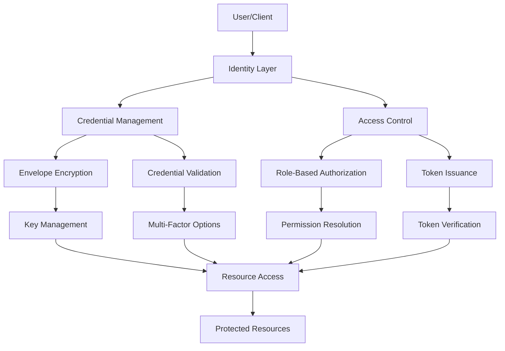
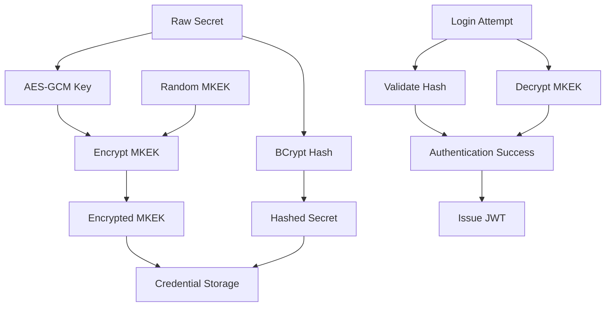

# EdgePrompt Security Engineering Methodology

## Implementation Notes

This document provides a high-density algorithmic specification for implementing and validating the security architecture of the EdgePrompt system. It presents a formal model for identity, authentication, and authorization that aligns with EdgePrompt's core principles of zero-single-secret-compromise, cryptographic compartmentalization, and environment-agnostic operation. This specification is designed to be implemented by system developers across various languages and environments, with particular attention to resource-constrained edge deployments.

**Key implementation considerations:**
- This is an algorithm-level specification rather than code-level implementation
- Implementation can be generated in any language (C#, Rust, Go, JavaScript, etc.) from these specifications
- All primitives are designed for minimal resource consumption in constrained environments
- Security guarantees persist across edge, cloud, and hybrid deployments
- No component requires cloud connectivity for base security functions
- All operations maintain formal verification properties regardless of deployment context

This document should be read in conjunction with the [SYSTEM_VISION.md](../foundation/SYSTEM_VISION.md), which outlines the philosophical foundations and educational principles of EdgePrompt, and the [PROMPT_ENGINEERING.md](PROMPT_ENGINEERING.md), which provides the formal specification for prompt safety and validation.

## 1. System Architecture



The security architecture implements a layered approach with no trust dependencies between components:
- The **Identity Layer** establishes unique identifiers with no shared secrets
- **Credential Management** handles secure storage and validation with envelope encryption
- **Access Control** evaluates permissions with role-based policies
- All operations are designed for stateless execution with minimal resources
- Threat compartmentalization ensures no single component compromise affects others

## 2. Core Algorithms

### 2.1 Identity and Credential Generation Algorithm

```
ALGORITHM GenerateIdentityWithCredential
INPUT: 
  - username: String
  - raw_secret: ByteArray (password or API key)
  - credential_type: Enum (Password, ApiKey)
OUTPUT: 
  - identity: Identity
  - credential: Credential

1. identity_id ← GenerateUlid()
2. identity ← CreateIdentity(identity_id, username)
3. base64_secret ← Base64Encode(raw_secret)
4. hashed_secret ← BcryptEnhancedHash(base64_secret, cost_factor=11)
5. mkek ← RandomBytes(32)  // AES-256 key
6. encrypted_mkek ← AESGCMEncrypt(key=raw_secret, data=mkek)
7. credential_id ← GenerateUlid()
8. credential ← CreateCredential(credential_id, identity_id, credential_type, hashed_secret, encrypted_mkek)
9. Return identity, credential
```

### 2.2 Credential Validation Algorithm

```
ALGORITHM ValidateCredential
INPUT:
  - credential: Credential
  - input_secret: ByteArray
OUTPUT:
  - result: Boolean
  - mkek: ByteArray (if successful, otherwise null)

1. base64_input ← Base64Encode(input_secret)
2. result ← BcryptEnhancedVerify(base64_input, credential.hashed_secret)
3. If result = true Then
4.     mkek ← AESGCMDecrypt(key=input_secret, data=credential.encrypted_mkek)
5.     Return true, mkek
6. Else
7.     Return false, null
8. End If
```

### 2.3 Token Issuance Algorithm

```
ALGORITHM IssueToken
INPUT:
  - identity: Identity
  - mkek: ByteArray
  - session_metadata: Object
OUTPUT:
  - token: String

1. signing_key ← DeriveSigningKey(mkek)
2. claims ← {
       "sub": identity.id,
       "name": identity.username,
       "roles": GetRolesForIdentity(identity.id),
       "iat": CurrentTimestamp(),
       "exp": CurrentTimestamp() + TOKEN_LIFETIME,
       "jti": GenerateUlid()
   }
3. For each entry in session_metadata:
4.     claims[entry.key] ← entry.value
5. End For
6. token ← SignJwt(claims, signing_key)
7. Return token
```

### 2.4 Token Verification Algorithm

```
ALGORITHM VerifyToken
INPUT:
  - token: String
  - identity_id: String
  - mkek: ByteArray
OUTPUT:
  - valid: Boolean
  - claims: Object (if valid, otherwise null)

1. signing_key ← DeriveSigningKey(mkek)
2. result ← VerifyJwtSignature(token, signing_key)
3. If result = false Then
4.     Return false, null
5. End If
6. claims ← DecodeJwt(token)
7. If claims.exp < CurrentTimestamp() Then
8.     Return false, null
9. End If
10. If claims.sub ≠ identity_id Then
11.     Return false, null
12. End If
13. Return true, claims
```

### 2.5 Data Encryption Algorithm

```
ALGORITHM EncryptUserData
INPUT:
  - mkek: ByteArray
  - plaintext: ByteArray
OUTPUT:
  - ciphertext: ByteArray

1. data_key ← GenerateRandomBytes(32)
2. encrypted_data_key ← AESGCMEncrypt(key=mkek, data=data_key)
3. iv ← GenerateRandomBytes(12)
4. encrypted_data ← AESGCMEncrypt(key=data_key, data=plaintext, iv=iv)
5. ciphertext ← Concatenate(iv, encrypted_data_key, encrypted_data)
6. Return ciphertext
```

### 2.6 Data Decryption Algorithm

```
ALGORITHM DecryptUserData
INPUT:
  - mkek: ByteArray
  - ciphertext: ByteArray
OUTPUT:
  - plaintext: ByteArray

1. iv, encrypted_data_key, encrypted_data ← Split(ciphertext)
2. data_key ← AESGCMDecrypt(key=mkek, data=encrypted_data_key)
3. plaintext ← AESGCMDecrypt(key=data_key, data=encrypted_data, iv=iv)
4. Return plaintext
```

### 2.7 Credential Rotation Algorithm

```
ALGORITHM RotateCredential
INPUT:
  - identity_id: String
  - old_credential: Credential
  - old_secret: ByteArray
  - new_secret: ByteArray
  - new_credential_type: CredentialType
OUTPUT:
  - new_credential: Credential

1. verification_result, mkek ← ValidateCredential(old_credential, old_secret)
2. If verification_result = false Then
3.     Raise AuthenticationError("Invalid old credential")
4. End If
5. base64_new_secret ← Base64Encode(new_secret)
6. hashed_new_secret ← BcryptEnhancedHash(base64_new_secret, cost_factor=11)
7. encrypted_mkek ← AESGCMEncrypt(key=new_secret, data=mkek)
8. new_credential_id ← GenerateUlid()
9. new_credential ← CreateCredential(
       new_credential_id,
       identity_id,
       new_credential_type,
       hashed_new_secret,
       encrypted_mkek
   )
10. Return new_credential
```

## 3. Data Schema Definitions

### 3.1 Identity Schema

```json
{
  "$schema": "http://json-schema.org/draft-07/schema#",
  "title": "Identity",
  "description": "Schema for identities in EdgePrompt",
  "type": "object",
  "required": ["id", "name"],
  "properties": {
    "id": {
      "type": "string",
      "format": "ulid",
      "description": "Unique identifier for the identity"
    },
    "name": {
      "type": "string",
      "minLength": 3,
      "maxLength": 100,
      "description": "Username or identity name"
    },
    "attributes": {
      "type": "array",
      "items": {
        "$ref": "#/definitions/IdentityAttribute"
      },
      "description": "Additional attributes for the identity"
    }
  },
  "definitions": {
    "IdentityAttribute": {
      "type": "object",
      "required": ["id", "type", "value"],
      "properties": {
        "id": {
          "type": "string",
          "format": "ulid"
        },
        "type": {
          "type": "string",
          "enum": ["Email", "DisplayName", "Locale"]
        },
        "value": {
          "type": "string"
        }
      }
    }
  }
}
```

### 3.2 Credential Schema

```json
{
  "$schema": "http://json-schema.org/draft-07/schema#",
  "title": "Credential",
  "description": "Schema for credentials in EdgePrompt",
  "type": "object",
  "required": ["id", "type", "secret", "identityId", "encryptedMKEK"],
  "properties": {
    "id": {
      "type": "string",
      "format": "ulid",
      "description": "Unique identifier for the credential"
    },
    "type": {
      "type": "string",
      "enum": ["Password", "ApiKey"],
      "description": "Type of credential"
    },
    "secret": {
      "type": "string",
      "description": "Hashed secret (Bcrypt hash)"
    },
    "identityId": {
      "type": "string",
      "format": "ulid",
      "description": "Identity this credential belongs to"
    },
    "encryptedMKEK": {
      "type": "string",
      "format": "base64",
      "description": "Master Key Encryption Key, encrypted with user secret"
    }
  }
}
```

### 3.3 Role and Permission Schema

```json
{
  "$schema": "http://json-schema.org/draft-07/schema#",
  "title": "Role",
  "description": "Schema for roles in EdgePrompt",
  "type": "object",
  "required": ["id", "name"],
  "properties": {
    "id": {
      "type": "string",
      "format": "ulid",
      "description": "Unique identifier for the role"
    },
    "name": {
      "type": "string",
      "minLength": 1,
      "maxLength": 100,
      "description": "Name of the role"
    }
  }
}
```

### 3.4 IdentityRole Schema

```json
{
  "$schema": "http://json-schema.org/draft-07/schema#",
  "title": "IdentityRole",
  "description": "Schema for the many-to-many relationship between identities and roles",
  "type": "object",
  "required": ["identityId", "roleId"],
  "properties": {
    "identityId": {
      "type": "string",
      "format": "ulid",
      "description": "Identity ID"
    },
    "roleId": {
      "type": "string",
      "format": "ulid",
      "description": "Role ID"
    }
  }
}
```

### 3.5 Token Schema

```json
{
  "$schema": "http://json-schema.org/draft-07/schema#",
  "title": "Token",
  "description": "JWT token claims schema for EdgePrompt",
  "type": "object",
  "required": ["sub", "iat", "exp", "jti"],
  "properties": {
    "sub": {
      "type": "string",
      "format": "ulid",
      "description": "Subject (identity ID)"
    },
    "name": {
      "type": "string",
      "description": "Username"
    },
    "roles": {
      "type": "array",
      "items": {
        "type": "string"
      },
      "description": "Role names assigned to the identity"
    },
    "iat": {
      "type": "integer",
      "description": "Issued at (timestamp)"
    },
    "exp": {
      "type": "integer",
      "description": "Expiration (timestamp)"
    },
    "jti": {
      "type": "string",
      "format": "ulid",
      "description": "JWT ID (unique identifier for this token)"
    }
  }
}
```

## 4. Security Principles and Invariants

### 4.1 Zero-Single-Secret-Compromise Architecture

The security architecture of EdgePrompt is designed to maintain the following core invariants:

1. **No Single Point of Compromise**: No single secret (password, API key, token) can compromise the broader system.
2. **Cryptographic Compartmentalization**: Each identity maintains its own cryptographic boundary with no shared symmetric secrets.
3. **Environment Agnosticism**: All security primitives can operate in edge devices without cloud connectivity.
4. **Verifiable Security Properties**: All security guarantees can be formally verified through audit or code analysis.
5. **Minimal Trust Requirements**: No component trusts any other component without cryptographic verification.



### 4.2 Threat Mitigation Matrix

| Threat | Mitigation Strategy | Algorithm Reference |
|--------|---------------------|---------------------|
| Credential Database Leak | BCrypt hashing of secrets, MKEK encrypted with user secret | 2.1, 2.2 |
| Token Theft | Short-lived tokens, per-identity signing keys | 2.3, 2.4 |
| Cross-User Data Access | Per-user encryption keys derived from MKEK | 2.5, 2.6 |
| Brute Force Attacks | Computationally expensive BCrypt with high cost factor | 2.1, 2.2 |
| Side-Channel Timing Attacks | Constant-time comparison operations for sensitive data | All |
| Credential Rotation Risks | MKEK persists across rotations, no data loss | 2.7 |
| Hardware Limitations | Minimal resource requirements, stateless operations | All |

### 4.3 Implementation Recommendations for Constrained Environments

1. **Memory Optimization**:
   - Implement streaming decryption for large files
   - Release cryptographic contexts immediately after use
   - Use stack-based allocation where possible

2. **CPU Optimization**:
   - Scale BCrypt cost factor based on device capabilities
   - Implement progressive token validation to fail fast
   - Cache validation results with controlled TTL

3. **Storage Optimization**:
   - Store only essential security metadata
   - Implement lazy loading for credential verification
   - Compress security tokens where bandwidth is limited

4. **Edge-Specific Considerations**:
   - Implement secure storage backends appropriate for each platform
   - Use platform-specific secure enclaves where available
   - Fall back to software-based isolation when hardware security is unavailable

## 5. Cryptographic Primitives

### 5.1 BCrypt Enhanced Hashing

```
ALGORITHM BcryptEnhancedHash
INPUT:
  - input: String (base64-encoded secret)
  - cost_factor: Integer (default=11)
OUTPUT:
  - hash: String

1. salt ← GenerateRandomBytes(16)
2. hash ← BCrypt(input, salt, cost_factor)
3. Return hash
```

### 5.2 AES-GCM Encryption

```
ALGORITHM AESGCMEncrypt
INPUT:
  - key: ByteArray
  - data: ByteArray
  - iv: ByteArray (optional)
OUTPUT:
  - ciphertext: ByteArray

1. If iv is not provided Then
2.     iv ← GenerateRandomBytes(12)
3. End If
4. aesGcm ← CreateAESGCM(key)
5. tag ← ByteArray(16)
6. ciphertext ← ByteArray(data.Length)
7. aesGcm.Encrypt(iv, data, ciphertext, tag)
8. result ← Concatenate(iv, ciphertext, tag)
9. Return result
```

### 5.3 AES-GCM Decryption

```
ALGORITHM AESGCMDecrypt
INPUT:
  - key: ByteArray
  - data: ByteArray (iv + ciphertext + tag)
OUTPUT:
  - plaintext: ByteArray

1. iv ← data[0...11]
2. tag ← data[data.Length - 16...data.Length - 1]
3. ciphertext ← data[12...data.Length - 17]
4. aesGcm ← CreateAESGCM(key)
5. plaintext ← ByteArray(ciphertext.Length)
6. aesGcm.Decrypt(iv, ciphertext, tag, plaintext)
7. Return plaintext
```

### 5.4 HMAC-Based Key Derivation

```
ALGORITHM DeriveSigningKey
INPUT:
  - mkek: ByteArray
OUTPUT:
  - signing_key: ByteArray

1. info ← UTF8Encode("EdgePrompt.SigningKey")
2. signing_key ← HKDF-SHA256(mkek, length=32, info=info)
3. Return signing_key
```

## 6. Identity Lifecycle Management

### 6.1 Identity Creation

```
ALGORITHM CreateIdentityWithInitialCredential
INPUT:
  - username: String
  - email: String
  - password: String
OUTPUT:
  - identity: Identity

1. Validate(username, email, password)
2. identity_id ← GenerateUlid()
3. identity ← {
       id: identity_id,
       name: username
   }
4. email_attribute ← {
       id: GenerateUlid(),
       type: "Email",
       value: email,
       identityId: identity_id
   }
5. identity.attributes.Add(email_attribute)
6. password_bytes ← UTF8Encode(password)
7. credential ← CreateCredentialForNewIdentity(
       CredentialType.Password,
       password_bytes
   )
8. credential.identityId ← identity_id
9. PersistIdentity(identity)
10. PersistCredential(credential)
11. AssignDefaultRoles(identity_id)
12. Return identity
```

### 6.2 Multi-Factor Authentication Flow

```
ALGORITHM VerifyMultiFactorAuthentication
INPUT:
  - identity_id: String
  - primary_factor_verified: Boolean
  - secondary_factor_input: String
OUTPUT:
  - authentication_result: Boolean
  - mkek: ByteArray (if successful, otherwise null)

1. If not primary_factor_verified Then
2.     Return false, null
3. End If
4. secondary_factor ← GetSecondaryFactorForIdentity(identity_id)
5. If secondary_factor.type = "TOTP" Then
6.     result ← VerifyTOTP(secondary_factor.secret, secondary_factor_input)
7. Else If secondary_factor.type = "Recovery" Then
8.     result ← VerifyRecoveryCode(identity_id, secondary_factor_input)
9. Else
10.     result ← false
11. End If
12. If result = true Then
13.     credential ← GetPrimaryCredentialForIdentity(identity_id)
14.     mkek ← DecryptMKEK(credential, secondary_factor)
15.     Return true, mkek
16. Else
17.     Return false, null
18. End If
```

### 6.3 Recovery Workflow

```
ALGORITHM InitiateRecovery
INPUT:
  - identity_identifier: String (email or username)
OUTPUT:
  - recovery_token: String

1. identity ← FindIdentityByIdentifier(identity_identifier)
2. If identity = null Then
3.     Return ErrorWithGenericMessage()
4. End If
5. recovery_token ← GenerateSecureRandomString(32)
6. expiration ← CurrentTimestamp() + RECOVERY_TOKEN_LIFETIME
7. StoreRecoveryToken(identity.id, HashToken(recovery_token), expiration)
8. SendRecoveryEmail(GetEmailForIdentity(identity.id), recovery_token)
9. Return recovery_token
```

```
ALGORITHM CompleteRecovery
INPUT:
  - recovery_token: String
  - new_password: String
OUTPUT:
  - success: Boolean

1. token_hash ← HashToken(recovery_token)
2. token_record ← FindValidRecoveryToken(token_hash)
3. If token_record = null or token_record.expiration < CurrentTimestamp() Then
4.     Return false
5. End If
6. password_bytes ← UTF8Encode(new_password)
7. new_credential ← CreateCredentialForNewIdentity(
       CredentialType.Password,
       password_bytes
   )
8. new_credential.identityId ← token_record.identityId
9. InvalidateExistingCredentials(token_record.identityId, CredentialType.Password)
10. PersistCredential(new_credential)
11. InvalidateRecoveryToken(token_record.id)
12. Return true
```

## 7. Edge Deployment Considerations

### 7.1 Offline Authentication Flow

```
ALGORITHM OfflineAuthentication
INPUT:
  - username: String
  - password: String
  - local_credential_cache: CredentialCache
OUTPUT:
  - authentication_result: Boolean
  - mkek: ByteArray (if successful, otherwise null)

1. cached_identity ← local_credential_cache.GetIdentityByUsername(username)
2. If cached_identity = null Then
3.     Return false, null
4. End If
5. cached_credential ← local_credential_cache.GetCredentialForIdentity(cached_identity.id)
6. password_bytes ← UTF8Encode(password)
7. result, mkek ← ValidateCredential(cached_credential, password_bytes)
8. If result = true Then
9.     RefreshLastUsedTimestamp(cached_credential)
10.     Return true, mkek
11. Else
12.     Return false, null
13. End If
```

### 7.2 Synchronization Algorithm

```
ALGORITHM SynchronizeCredentials
INPUT:
  - local_credential_cache: CredentialCache
  - server_connection: ServerConnection
OUTPUT:
  - updated_credential_cache: CredentialCache

1. last_sync_timestamp ← local_credential_cache.GetLastSyncTimestamp()
2. changed_credentials ← server_connection.GetCredentialsModifiedSince(last_sync_timestamp)
3. For each credential in changed_credentials:
4.     local_credential ← local_credential_cache.GetCredentialById(credential.id)
5.     If local_credential = null or local_credential.updatedAt < credential.updatedAt Then
6.         local_credential_cache.StoreCredential(credential)
7.     End If
8. End For
9. local_credential_cache.SetLastSyncTimestamp(CurrentTimestamp())
10. Return local_credential_cache
```

### 7.3 Resource-Constrained Token Validation

```
ALGORITHM LightweightTokenValidation
INPUT:
  - token: String
  - public_key_cache: PublicKeyCache
OUTPUT:
  - valid: Boolean
  - claims: Object (if valid, otherwise null)

1. If token is malformed Then
2.     Return false, null
3. End If
4. header, payload, signature ← SplitToken(token)
5. decoded_header ← DecodeBase64Url(header)
6. kid ← decoded_header.kid
7. public_key ← public_key_cache.GetKey(kid)
8. If public_key = null Then
9.     Return false, null
10. End If
11. valid ← VerifySignature(token, public_key)
12. If not valid Then
13.     Return false, null
14. End If
15. claims ← DecodeBase64Url(payload)
16. If claims.exp < CurrentTimestamp() Then
17.     Return false, null
18. End If
19. Return true, claims
```

## 8. Testing and Validation Approach

### 8.1 Security Testing Framework

```
ALGORITHM SecurityTestSuite
INPUT:
  - implementation: EdgePromptImplementation
OUTPUT:
  - test_results: Array<TestResult>

1. results ← []
2. results.Add(TestCredentialCreation(implementation))
3. results.Add(TestCredentialValidation(implementation))
4. results.Add(TestTokenIssuanceAndValidation(implementation))
5. results.Add(TestDataEncryptionDecryption(implementation))
6. results.Add(TestCredentialRotation(implementation))
7. results.Add(TestMultiFactorAuthentication(implementation))
8. results.Add(TestRecoveryWorkflow(implementation))
9. results.Add(TestOfflineAuthentication(implementation))
10. results.Add(TestResourceConstraints(implementation))
11. Return results
```

### 8.2 Formal Verification Properties

The following properties should be formally verified in any implementation:

1. **Credential Secrecy**: The plaintext of any credential can never be recovered from stored data.
2. **Forward Secrecy**: Compromise of a new credential cannot compromise data encrypted with the old credential.
3. **Isolation**: No identity can access data belonging to another identity without explicit authorization.
4. **Tampering Detection**: Any modification to encrypted data is detectable.
5. **Resource Bounds**: All operations have known, bounded resource requirements.

### 8.3 Performance Benchmarking

```
ALGORITHM BenchmarkSecurityOperations
INPUT:
  - implementation: EdgePromptImplementation
  - hardware_profile: HardwareProfile
OUTPUT:
  - benchmark_results: BenchmarkResults

1. results ← {
       credential_creation: [],
       credential_validation: [],
       token_issuance: [],
       token_validation: [],
       data_encryption: [],
       data_decryption: []
   }
2. ApplyHardwareProfile(hardware_profile)
3. For i = 1 to BENCHMARK_ITERATIONS:
4.     results.credential_creation.Add(MeasureExecutionTime(() => {
5.         implementation.GenerateIdentityWithCredential("test", GenerateRandomBytes(16), CredentialType.Password)
6.     }))
7.     // Similar measurements for other operations
8. End For
9. Return CalculateStatistics(results)
```

## 9. Alignment with EdgePrompt Vision

### 9.1 Educational Equity Support

The security architecture directly supports EdgePrompt's educational equity mission through:

1. **Universal Access**: Authentication works in any environment, including those with limited connectivity
2. **Teacher Control**: Security boundaries preserve teacher autonomy while protecting student data
3. **Resource Awareness**: All security operations have minimal resource requirements
4. **Offline Operation**: Core security functions work without cloud connectivity
5. **Cross-Cultural Application**: Security model is independent of language or cultural context

### 9.2 Guardrail Integration

The security architecture integrates with EdgePrompt's guardrail philosophy by:

1. Enforcing permission boundaries that preserve educational workflows
2. Maintaining credential isolation that prevents cross-user data access
3. Supporting role-based access control aligned with educational contexts
4. Providing data protection that maintains privacy across diverse environments
5. Enabling secure attribution and auditing of educational content

### 9.3 Resource Optimization

All security operations are optimized for resource-constrained environments:

1. Credential validation requires minimal memory (< 100 KB)
2. Token validation can operate with constant memory regardless of token size
3. Cryptographic operations use optimized primitives for low-power devices
4. Storage requirements are minimized through careful key management
5. All operations can execute efficiently on edge hardware (Raspberry Pi class devices)

## 10. Implementation Guide

### 10.1 Recommended Technology Stack

| Component | Recommended Technologies |
|-----------|--------------------------|
| Credential Storage | PostgreSQL, SQLite (edge), ACID-compliant DB |
| Cryptography | NaCl/libsodium, OpenSSL (minimized), BoringSSL |
| Token Format | PASETO (preferred), JWT (with careful configuration) |
| Offline Cache | SQLite, LevelDB, RocksDB |
| Transport Security | TLS 1.3, Mutual TLS where appropriate |

### 10.2 Implementation Checklist

1. **Cryptographic Library Selection**:
   - Ensure chosen library has constant-time implementations
   - Verify no deprecated algorithms are used
   - Confirm proper entropy sources for randomization

2. **Storage Security**:
   - Implement proper database encryption at rest
   - Use parameterized queries to prevent SQL injection
   - Maintain proper index coverage for security queries

3. **Authentication Flow**:
   - Implement rate limiting and exponential backoff
   - Add proper logging of authentication events
   - Ensure proper error messages that don't leak information

4. **Token Management**:
   - Implement proper token revocation mechanism
   - Add refresh token rotation for long-lived sessions
   - Ensure proper audience and issuer validation

5. **Deployment Security**:
   - Use proper secure deployment practices
   - Implement continuous security testing
   - Establish proper key rotation procedures

### 10.3 Migration Path

For existing systems transitioning to the EdgePrompt security model:

1. **Phase 1: Parallel Operation**
   - Implement new security components alongside existing system
   - Begin storing credentials in new format without changing validation
   - Introduce dual token issuance for compatibility

2. **Phase 2: Credential Migration**
   - Prompt users to update credentials on next login
   - Migrate to new credential format incrementally
   - Implement new validation paths with fallback

3. **Phase 3: Token Format Migration**
   - Update clients to handle new token format
   - Implement dual validation during transition
   - Deprecate old token format with clear timeline

4. **Phase 4: Full Cutover**
   - Disable legacy authentication paths
   - Complete migration of all credentials
   - Implement full security monitoring

## 11. Conclusion and Next Steps

This security engineering specification provides a comprehensive framework for implementing EdgePrompt's security architecture. It maintains the core principles of zero-single-secret-compromise, cryptographic compartmentalization, and environment-agnostic operation while supporting the educational mission outlined in SYSTEM_VISION.md.

### 11.1 Recommended Development Sequence

1. Implement core credential management algorithms
2. Build token issuance and validation components
3. Develop data encryption utilities
4. Create identity lifecycle management workflows
5. Implement edge deployment optimizations
6. Deploy comprehensive security testing suite

### 11.2 Future Security Enhancements

1. **Hardware-backed security**: Integration with TEE, TPM, and secure enclaves
2. **Biometric authentication**: Framework for secure biometric template storage
3. **Zero-knowledge proofs**: For privacy-preserving verification
4. **Post-quantum readiness**: Migration path to quantum-resistant algorithms
5. **Federated authentication**: Cross-instance identity verification

This specification ensures that EdgePrompt's security architecture maintains formal correctness and practical deployability across diverse environments, particularly resource-constrained educational settings where robust security is most needed but often hardest to implement.
